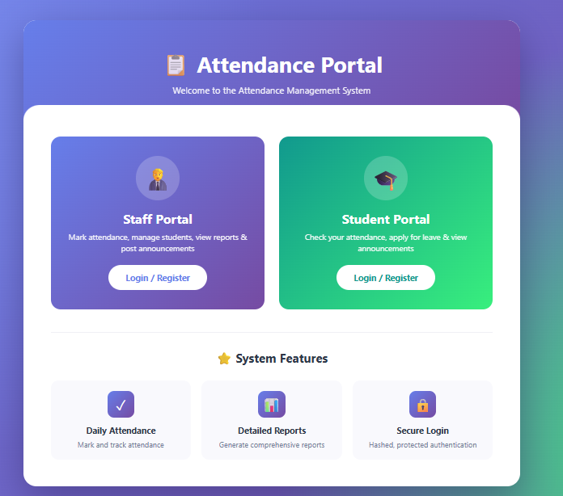
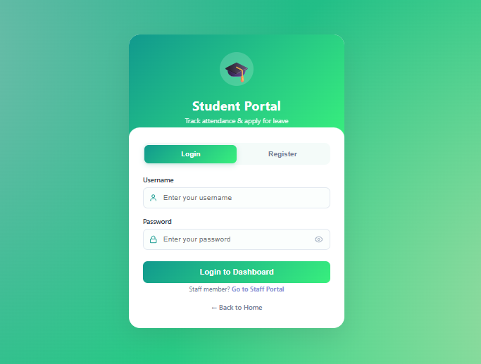
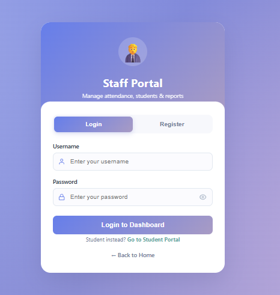
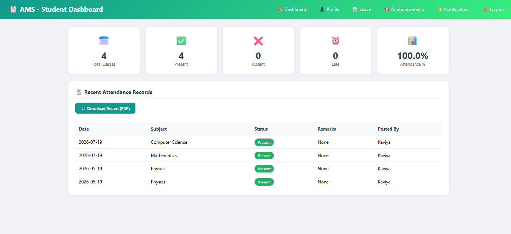
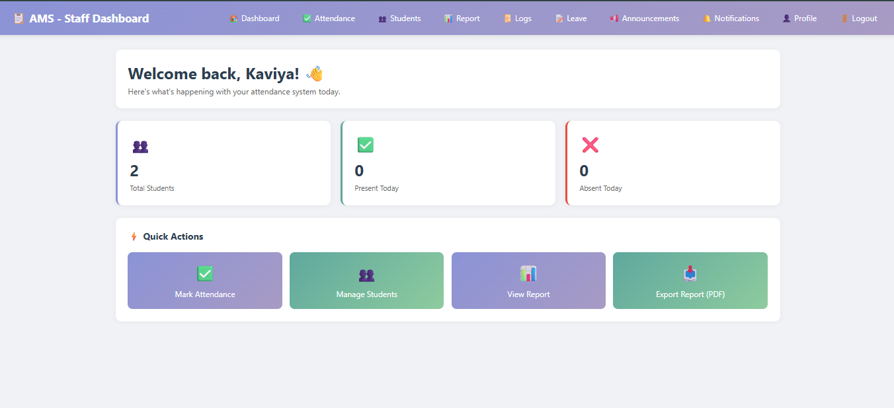
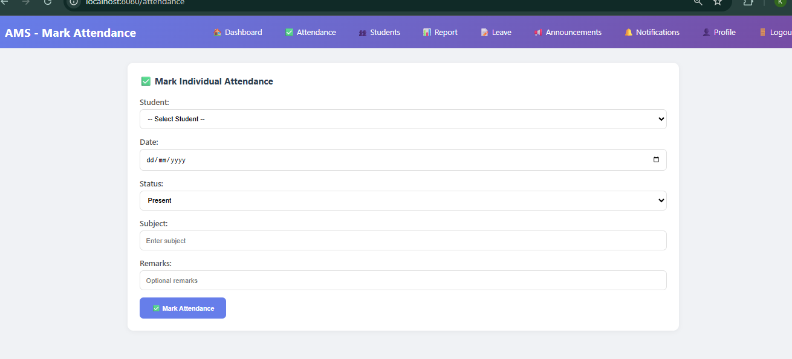
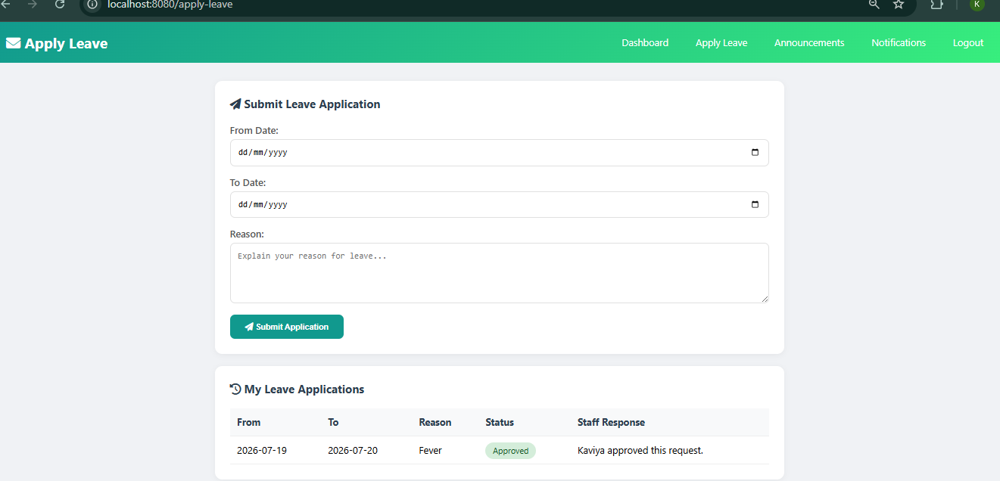
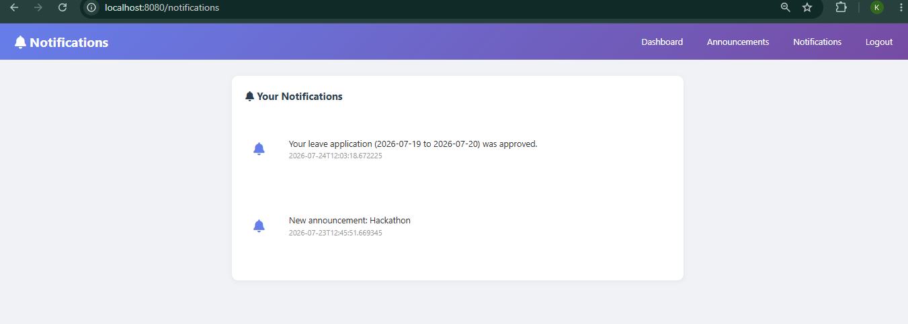
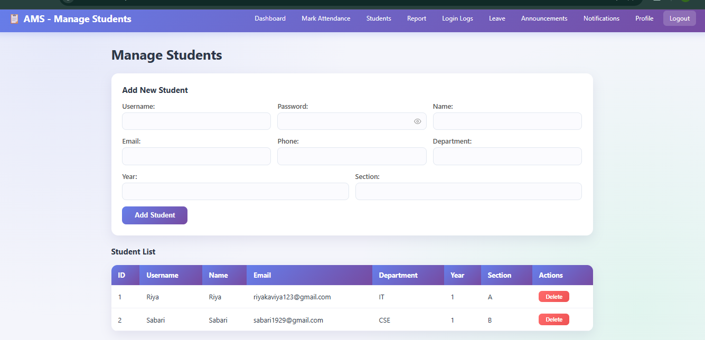

# 📚 Attendance Management System


---

# 📌 Project Overview

Attendance Management System is a full-stack web application developed using **Spring Boot**, **MySQL**, **HTML**, **CSS**, and **JavaScript**.

The system reduces manual attendance work by allowing students and staff to manage attendance online.

---

# 🎯 Objective

- Reduce manual attendance process
- Improve accuracy
- Easy attendance tracking
- Leave Management
- Student & Staff Portal

---

# 🚀 Features

## 👨‍🎓 Student

- Student Login
- View Attendance
- Attendance Report
- Leave Application
- Notifications
- Announcements
- Student Profile

## 👨‍🏫 Staff

- Staff Login
- Student Management
- Attendance Management
- Leave Approval
- Attendance Reports
- Notifications
- Announcements
- Login Logs

---

# 🛠 Technologies

### Backend

- Java
- Spring Boot
- Spring Data JPA
- Maven

### Frontend

- HTML5
- CSS3
- JavaScript

### Database

- MySQL

### Tools

- IntelliJ IDEA
- Postman
- Git
- GitHub

---

# 📂 Project Structure

```text
AttendanceManagementSystem
│── src
│── screenshots
│── pom.xml
│── README.md
```

---

# 📸 Screenshots

## 🏠 Home Page



---

## 👨‍🎓 Student Login



---

## 👨‍🏫 Staff Login



---

## 📊 Student Dashboard



---

## 📊 Staff Dashboard



---

## ✅ Attendance Page



---

## 📝 Leave Management



---

## 🔔 Notifications



---

## 👤 Student Profile



# ⚙ Installation

## Clone Repository

```bash
git clone https://github.com/Kaviyadharmaraj6369/AttendanceManagementSystem.git
```

Open project in IntelliJ IDEA.

Create MySQL Database.

```sql
CREATE DATABASE attendance_db;
```

Update:

```
application.properties
```

```properties
spring.datasource.url=jdbc:mysql://localhost:3306/attendance_db
spring.datasource.username=root
spring.datasource.password=your_password
```

Run:

```
AttendanceManagementSystemApplication.java
```

Open:

```
http://localhost:8080
```

---

# 🌟 Future Enhancements

- QR Attendance
- Face Recognition
- Parent Portal
- Mobile App
- Email Notifications
- Export PDF
- Analytics Dashboard

---

# 👩‍💻 Author

**Kaviya D**

GitHub:
https://github.com/Kaviyadharmaraj6369

---

⭐ If you like this project, give it a Star.
